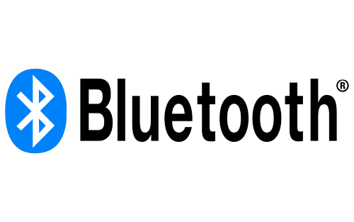

# BLE para todos

### Objetivo: Crear un prototipo rápido de una Aplicación móvil usando AppInventor, que muestre los datos obtenidos mediante una solución BLE (Bluetooth Low Energy) basada en Arduino.

Es posible que haya oído hablar de Bluetooth Low Energy , Bluetooth Smart o BLE. Ha sido una tecnología muy aplicada a dispositivos como sensores de frecuencia cardíaca, podómetros, sensores de bicicletas, entre otros. En este taller se usara la biblioteca "[ArduinoBLE](https://www.arduino.cc/reference/en/libraries/arduinoble/)" la cual es compatible con varios microcontroladores, entre ellos el microcontrolador ESP32.

Se abordaran algunos conceptos básicos sobre Bluetooth de bajo consumo "BLE", se desarrollara un programa en Arduino IDE para ESP32, que envie a una aplicación móvil, los datos de temperatura y humedad recolectados de un sensor DHT11. 

La aplicación móvil se desarrollará en MIT App Inventor.

### Conceptos básicos de Bluetooth de bajo consumo

Bluetooth Low Energy , o BLE, es un subconjunto del Bluetooth clásico y se introdujo junto con la especificación Bluetooth 4.0. A diferencia del Bluetooth clásico, BLE tiene un bajo consumo de energía y mantiene un rango similar.

Los dispositivos que funcionan con BLE pueden tener dos funciones diferentes en una conexión, Dispositivo Central o Dispositivo Periférico ( Central Device o Peripheral Device ).

Dispositivos centrales.- Por lo general son teléfonos celulares, tabletas, computadoras, etc. Estos son dispositivos centrales que reciben datos. 

Dispositivos periféricos.- son sensores y dispositivos de bajo consumo que se conectan al dispositivo central. 

También podemos pensarlo como una estructura cliente/servidor, donde un teléfono celular es el cliente y el sensor es el servidor que “sirve” sus datos al cliente.

GATT ( Perfil de atributo genérico ).- Es la forma en que se organizan los datos para la comunicación entre dispositivos. 

GATT se compone de uno o más servicios que a su vez se componen de características. 

Existen especificaciones GATT estándar para los tipos de aplicaciones más comunes que se encuentran en el mercado. Varias de estas especificaciones se pueden encontrar en el sitio [web oficial de Bluetooth](https://www.bluetooth.com/) . Las características a su vez son básicamente los valores mismos.

Los servicios y funciones se identifican mediante un UUID.

UUID: Son las siglas en inglés del Identificador Universal Único. El UUID está compuesta por 32 digítos hexadecimales, mostrados en 5 grupos separados por guiones.

Por ejemplo, "0x180F" o "6E400001-B5A3-F393-E0A9-E50E24DCCA9E". 

Lo importante es que podemos crear nuestras propias funciones personalizadas o incluso usar funciones existentes, como la detección del entorno.

Para ser un poco más prácticos, veamos, por ejemplo, el servicio oficial de nivel de batería "Battery Service". 

Este servicio tiene un UUID de 0x180F y una característica llamada "Nivel de batería" con el UUID 0x2A19. 

Imagina que hay un sensor BLE que mide el nivel de la batería (servicio) y que envía datos indicando el nivel de la batería (característica). 

Si un teléfono celular se conecta a este sensor, el teléfono celular ya sabrá que ese sensor mide el nivel de la batería y sus datos enviados son el nivel de la batería en sí.

Pensando en un ESP32, si tuviera programadas estas características, sería “un sensor” de nivel de batería y sería reconocido como tal por cualquier aplicación móvil BLE (aquí tienes un enlace para poner tu creatividad en acción creando un dispositivo BLE, que puede ser cualquiera de estos). [Enlace](https://www.bluetooth.com/specifications/specs/)

### **Programa Bluetooth Low Energy con ESP32**

Para programar el ESP32 usando el IDE de Arduino, siga las instrucciones de instalación de acuerdo a su sistema operativo. Asegúrese de que puede compilar y cargar cualquier programa para el ESP32, por ejemplo, hacer parpadear un LED.

A continuación en el IDE de Arduino. También asegúrese de tener la biblioteca de sensores DHT instalada en su IDE.

El programa básicamente establece los UUID del servicio de comunicación UART, lee la humedad y la temperatura del sensor DHT y transmite estos datos a la aplicación móvil. Los datos se envían en una sola variable, pero en formato CSV, con la temperatura y la humedad separadas por una coma.

### **Aplicación movil** 

Para que podamos ver los datos enviados por el ESP32 en nuestros teléfonos móviles, desarrollamos una aplicación utilizando la plataforma App Inventor. 

Hay una extensión hecha especialmente para la comunicación de dispositivos usando BLE. Esta extensión se puede descargar [aquí](https://iot.appinventor.mit.edu/assets/resources/edu.mit.appinventor.ble-20200828.aix) e importar a App Inventor.

El diseño de la aplicación es el siguiente, pero puede usar su creatividad y cambiar la **apariencia** de la aplicación. 

**ToDo**

Hay dos botones para administrar la conexión con el ESP32 y un botón más abajo para encender y apagar el LED incorporado del ESP32. En dos etiquetas mostramos la temperatura y la humedad del DHT11.

**Sección de bloques**

Es en la sección de bloques donde se realiza la programación de la aplicación. Vea en la foto de abajo la estructura general de la aplicación:

**Primero declaramos los UUID utilizados por ESP32.**

**Luego gestionamos el escaneo y conexión de dispositivos:**

**El botón de desconexión es el encargado de desconectar el ESP32.**

**Un temporizador verifica si el dispositivo aún está conectado y si se han recibido datos de ESP32. Tan pronto como se reciben los datos, se activa el evento StringsReceived , que muestra los datos de temperatura y humedad en las etiquetas respectivas . En este bloque separamos los datos de temperatura y humedad que se recibieron, separados por una coma.**

**Cuando se hace clic en el botón LED, el siguiente bloque envía un carácter A o B al ESP32, que a su vez enciende el LED si recibe A o lo apaga si recibe B.**

Este proyecto ESP32 Bluetooth Low Energy se basó en el proyecto original de Juan Bauermeister y se puede encontrar [aquí](https://www.filipeflop.com/blog/bluetooth-low-energy-com-esp32-e-dht11/)

